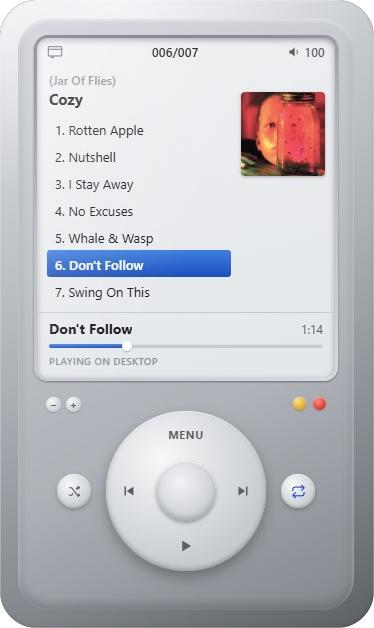

# Retro Music Player

A desktop Spotify **remote control** styled as an early-2000s hardware device — brushed metal shell, LCD screen, functional click-wheel, physical-look transport buttons.



Built with **Electron + React + TypeScript**. This app doesn't play audio itself — it remote-controls whatever Spotify client is already running (the desktop app, a phone, a speaker, etc.) via Spotify's Web API, the same way Spotify's own Connect device picker does. Point it at your library, browse with the click wheel, hit select, and playback starts on your phone/computer while this window just shows what's going on and steers it.

Because it never decodes audio, it needs no DRM/Widevine setup and runs on stock Electron.

## Setup

### 1. Register a Spotify app

1. Go to the [Spotify Developer Dashboard](https://developer.spotify.com/dashboard) and create an app.
2. In **Settings → Redirect URIs**, add exactly:
   ```
   http://127.0.0.1:17872/callback
   ```
3. Copy the **Client ID** shown on the app page (you do *not* need the client secret — this app uses PKCE).

### 2. Configure the app

```bash
cp .env.example .env
```

Edit `.env` and set:

```
VITE_SPOTIFY_CLIENT_ID=your_client_id_here
```

### 3. Install dependencies

```bash
npm install
```

### 4. Run in development

```bash
npm run dev
```

This starts the Vite dev server and launches the Electron window pointed at it, with hot reload for the renderer.

Clicking **Connect Spotify** opens your system browser to Spotify's login/consent screen. After approving, it redirects to a local loopback server the app is listening on, which hands the auth code back to the app and closes the browser tab.

> **Before you can play anything, open Spotify somewhere** — the desktop app, mobile app, or a Spotify Connect speaker — so there's a device for this app to find and control. The app polls `GET /me/player/devices` and `GET /me/player` on an adaptive interval to know what's playing and what's available; there's no push notification API for this, so on-screen state can lag the real device by a moment.

### 5. Build a distributable

```bash
npm run build   # compiles renderer + main/preload
npm run dist    # packages an installer via electron-builder (dmg/nsis/AppImage)
```

## How the controls map

| Control | Action |
|---|---|
| **Click wheel** (drag in a circle) | Scrolls the on-screen list, like a real click-wheel's rotational detents. |
| **Center button** | Selects the highlighted row — opens a playlist, plays a track from that point in the playlist, or switches to the highlighted device on the Devices screen. |
| **MENU** (top of wheel) | Inside a playlist/album/drilled-in list: goes back to the list you came from. At the top level: short-press cycles through **Recently Played** (default home screen) → **Playlists** → **Devices** (every Spotify Connect device visible on your account, with a ♪ marking the active one). **Long-press** (~0.7s) at the top level logs you out — use this to re-authorize after a scope change or to switch accounts. |
| **◀︎ ▶︎ / ⏯** (wheel cardinal buttons) | Previous / next / play-pause on whichever device is currently active. |
| **Satellite buttons** (either side of the wheel) | Shuffle and repeat — wired to Spotify's real `PUT /me/player/shuffle` / `PUT /me/player/repeat`, reflecting and controlling actual playback state, not just local UI. |
| **Volume +/-** (top-left of the shell, mirroring the close/minimize dots on the top-right) | Steps the active device's volume up/down by 5%, via `PUT /me/player/volume`. The title bar's volume readout comes from polling, so it reflects the real device level — including changes made elsewhere, like the phone. |

## How remote control works

- Playing a track calls `PUT /me/player/play` with a `context_uri` (and, if nothing's currently active, a `device_id` to wake up) — exactly what the official Spotify Connect UI does.
- If more than one device is visible on the account and none is active, the app won't guess which one to use — it shows a notice asking you to pick one from the Devices screen. If exactly one device is visible, it's used automatically.
- Transport controls (play/pause/next/previous/shuffle/repeat) always target whatever's currently active, regardless of which screen you're looking at.
- All playback UI (track name, progress bar, shuffle/repeat state, volume, and the "Playing on \<device\>" label) comes from polling `GET /me/player`; the progress bar interpolates locally between polls so it doesn't visibly stutter.
- Polling is adaptive rather than a flat interval: ~0.8s for a few seconds right after you use a control, ~3s at steady state while the window is visible, ~8s when the window is minimized or hidden — snappy when it matters, lighter on API calls the rest of the time.

## Scripts

| Command | Description |
|---|---|
| `npm run dev` | Vite dev server + Electron window, with renderer hot reload |
| `npm run build` | Compiles the renderer (Vite) and the Electron main/preload processes |
| `npm run dist` | Builds and packages a distributable installer via `electron-builder` |
| `npm run lint` | Runs `oxlint` over the project |
| `npm run preview` | Serves the built renderer with Vite's preview server (renderer only, no Electron shell) |

## Known limitations

- **No push updates**: everything is polled, so there's inherent lag between a change on the real device and this app noticing, especially in the background.
- **Track search**: the Spotify API client includes a `search` method but there's no search UI yet.
- **Curated/other-user playlists**: Spotify's API blocks reading the track list of certain playlists (e.g. algorithmic ones like Discover Weekly, or some other-user playlists) even though they appear in your library. Opening one shows a brief on-screen notice and falls back to the current list rather than getting stuck.
- **Recently Played resolution**: The home screen aims to show 8 distinct recently-played playlists/albums. The history endpoint returns individual track plays capped at 50 per request, so if your last 50 plays collapse into fewer than 8 unique playlists/albums, the app pages backward through more history to try to find 8.
- **No devices found**: If Spotify isn't open anywhere, `/me/player/devices` returns an empty list and the app shows a notice asking you to open Spotify first — there's genuinely nothing to control until then.
- Playback itself still happens on whatever device is playing — if that's a phone or desktop Spotify Free account, Spotify's own Free-tier restrictions on that device still apply. This app doesn't add or remove any of those restrictions; it just relays commands.

## Tech stack

- [Electron](https://www.electronjs.org/) — desktop shell, loopback OAuth server, window chrome
- [React](https://react.dev/) + [TypeScript](https://www.typescriptlang.org/) — renderer UI
- [Zustand](https://github.com/pmndrs/zustand) — app state
- [Vite](https://vite.dev/) — renderer build/dev server
- [oxlint](https://oxc.rs/docs/guide/usage/linter) — linting
- [electron-builder](https://www.electron.build/) — packaging installers
